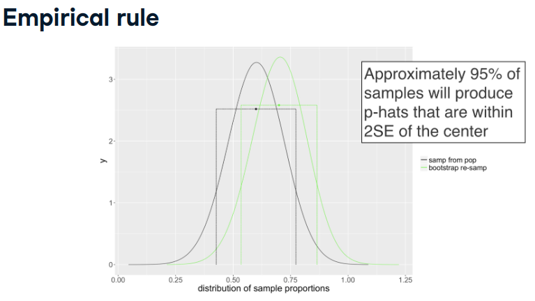
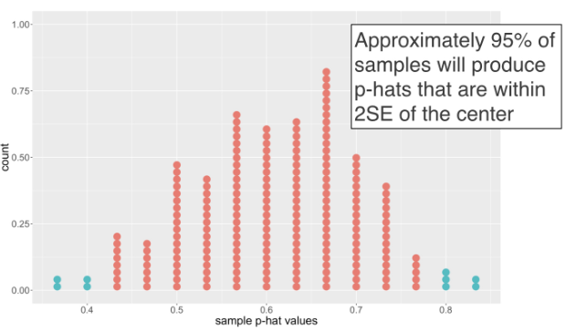

```{r}
# Load packages
library(ggplot2)
library(tidyverse)
library(infer)

all_polls <- readRDS("./datasets/all_polls.rds")
one_poll_boot_0.8 <- readRDS("./datasets/one_poll_boot_0_8.rds")

one_poll_0.8 <- structure(list(vote = c("yes", "yes", "yes", "yes", "yes", "yes", 
"yes", "yes", "yes", "yes", "yes", "yes", "yes", "yes", "yes", 
"yes", "yes", "no", "yes", "yes", "no", "yes", "yes", "yes", 
"no", "yes", "no", "no", "yes", "yes")), row.names = c(NA, -30L
), class = c("tbl_df", "tbl", "data.frame"))

```


```{r}
all_polls
```


# Parameters and confidence intervals


## What is the parameter ? 
In November 2016, the voters elected a new president of the United States. Prior to the election, thousands of polls were taken to gauge the popularity of each of the candidates. Leaving aside the idea that popular opinion changes over time, a poll can be thought of as a sample of individuals measured so as to estimate the proportion of all voters who will vote for each candiate (i.e. the population parameter).

Consider an election in your home town that will take place in a week's time. You poll a randomly selected subset of the voters in your town and ask them if they plan to vote for Candidate X or Candidate Y. In this chapter, we will focus on sampling variability—the variability in sample proportions due to polling different randomly selected individuals from the population.

Before investigating the sampling variability, what is the population parameter of interest?

- The proportion of all voters in your town who will vote for Candidate X on election day.


## Hypthesis test or confidence interval

A university is trying to determine whether parking is a problem on its campus. The student newspaper contacts a random sample of 200 students and asks whether or not they are frustrated with the parking situation. They want to estimate the proportion of students at the college who are frustrated with the parking situation.

In this setting, which is more appropriate, a hypothesis test or a confidence interval?

- Confidence interval because the goal is to estimate a population parameter.

# Bootstrapping

How do samples from the null population vary ?

- __statistic__, proportion of successes in sample -> $\hat p$
- __parameter__, proportion of successes in population -> p

 
In **Confidence Intervals**

- there is no __null population__, unlike in hypothesis testing


## Resampling from a sample

To investigate how much the estimates of a population proportion change from sample to sample, you will set up two sampling experiments.

In the first experiment, you will simulate repeated samples from a population. In the second, you will choose a single sample from the first experiment and repeatedly resample from that sample: a method called bootstrapping. More specifically:

Experiment 1: Assume the true proportion of people who will vote for Candidate X is 0.6. Repeatedly sample 30 people from the population and measure the variability of $\hat p$ (the sample proportion).

Experiment 2: Take one sample of size 30 from the same population. Repeatedly sample 30 people (with replacement!) from the original sample and measure the variability of $\hat p^*$ (the resample proportion).

It's important to realize that the first experiment relies on knowing the population and is typically impossible in practice. The second relies only on the sample of data and is therefore easy to implement for any statistic. Fortunately, as you will see, the variability in, or the proportion of "successes" in a sample, is approximately the same whether we sample from the population or resample from a sample.


### Experiment 1

```{r}
# Compute p-hat for each poll
ex1_props <- all_polls %>% 
  # Group by poll
  group_by(poll) %>% 
  # Calculate proportion of yes votes
  summarize(stat = mean(vote == "yes"))
  
# Review the result
ex1_props
```

```{r}
# Select one poll from which to resample
one_poll <- all_polls %>%
  # Filter for the first poll
  filter(poll == 1) %>%
  # Select vote
  select(vote)
one_poll
```


### Experiment 2

```{r}
# Compute p-hat* for each resampled poll
ex2_props <- one_poll %>%
  # Specify vote as the response, where yes means success
  specify(response = vote, success = "yes") %>%
  # Generate 1000 reps of type bootstrap
  generate(reps = 1000, type = "bootstrap") %>% 
  # Calculate the summary stat "prop"
  calculate(stat = "prop")

ex2_props
```


Calculate variability of both samples

```{r}
ex1_props %>% 
  summarize(variability = sd(stat))
  
ex2_props %>% 
  summarize(variability = sd(stat))
```
The variability in the proportion of “successes” in a sample is approximately the same whether we sample from the population or resample from a sample.


## Visualizing the variability of p-hat

In order to compare the variability of the sampled 
 $\hat p$ and  $\hat p^*$ values in the previous exercises, it is valuable to visualize their distributions. To recall, the exercises walked through two different experiments for investigating the variability of 
 $\hat p$ and  $\hat p^*$ :
 
- Experiment 1: Sample (n=30) repeatedly from an extremely large population (gold standard, but unrealistic)

- Experiment 2: Resample (n=30) repeatedly with replacement from a single sample of size 30
 
```{r}
# Combine data from both experiments
both_ex_props <- bind_rows(ex1_props, ex2_props, .id = "experiment")

# Using both_ex_props, plot stat colored by experiment
ggplot(both_ex_props, aes(stat, color = experiment)) + 
  # Add a density layer with bandwidth 0.1
  geom_density(bw = 0.1)
```

Note that the curves are quite similar in shape. The sampled 
 values are centered around the true (typically unknown parameter) parameter (red); the resampled 
 values are centered around the estimate from the very first poll (green). Great work!


## Always resample the original number of observations

In the bootstrap examples, exactly 30 observations have been repeatedly resampled from the original sample. The choice of 30 was given because the original sample had 30 observations. If we had resampled 3 observations instead, the resampled $\hat p^*$
 value could have ranged from 0 to 1 (producing a much larger $SE(\hat p^*)$
 than desired). If we had resampled 300 observations instead, the resampled $\hat p^*$ 
 value would have been close to the same number each time (producing a much smaller $SE(\hat p^*)$
 than desired).

Generally, if $n$ represents the size of the original sample, how many observations should we resample with replacement when bootstrapping?


- Resample exactly $n$ observations because then the variability of $\hat p^*$
 will be most similar / representative of the original sampling process.

 Resamples with replacement are an excellent model for the process of taking the original sample from the population. Remember, in research problems, you don't have an ability to take more than one original sample, but you can take as many resamples as you like.

# Variability in p-hat
Remember the goal of creating a confidence interval is to find a range of plausible values for the true population parameter.

The observed statistic is a good estimate, but it is impossible to know whether it is one of the p-hat values, which is very close to the true parameteror whether it is one of the p-hat values, which is in the tail of the distribution of observed statistics. We won't know how far away the statistic is from the parameter just by looking at the sample of data. The variability of the p-hat statistics gives a measure for how far apart any given observed p-hat and the parameter are expected to be.


## The standar error of $\hat p$
Note that bootstrapping, or resampling with replacement the same number of observations as were in the original sample, provided approximately the same standard error as sampling many p-hat values from the population. The standard error is measured by the width of the distribution and here we can see that the green bootstrap distribution is approximately the same width as the black distribution, which measured the true variability of p-hat values from the population. Lucky for us that bootstrapping works because in real life we only have one dataset! We can use the value of the standard error to count the number of sample p-hats, which are close to the parameter.






Note that in the exercises, we refer to the intervals created from the empirical rule as t-intervals. The "t" is simply the label that statisticians use and we provide that label here for you in case you want to learn more about these types of intervals in future courses. Here, in red, we see all the sample p-hat values that are close to the true parameter. If our data is one of the red dots, our confidence interval will correctly capture the true parameter.

## Empirical Rule

Many statistics we use in data analysis (including both the sample average and sample proportion) have nice properties that are used to better understand the population parameter(s) of interest.

One such property is that if the variability of the sample proportion (called the standard error, or $SE$) is known, then approximately 95% of 
 values (from different samples) will be within $2SE$ of the true population proportion.

To check whether that holds in the situation at hand, let's go back to the polls generated by taking many samples from the same population.

```{r}
# Proportion of yes votes by poll
props <- all_polls %>% 
  group_by(poll) %>% 
  summarize(prop_yes = mean(vote == "yes"))

# The true population proportion of yes votes
true_prop_yes <- 0.6

# Proportion of polls within 2SE
props %>%
  # Add column: is prop_yes in 2SE of 0.6
  mutate(is_in_conf_int = abs(prop_yes - true_prop_yes) < 2 * sd(prop_yes)) %>%
  # Calculate  proportion in conf int
  summarize(prop_in_conf_int = mean(is_in_conf_int == T))
```
In this example, it looks like 96.6% are within 2 standard errors of the true population parameter.

## Bootstrap t-confidence interval
```{r}
# From previous exercises
one_poll <- all_polls %>%
  filter(poll == 1) %>%
  select(vote)

one_poll_boot <- one_poll %>%
  specify(response = vote, success = "yes") %>%
  generate(reps = 1000, type = "bootstrap") %>% 
  calculate(stat = "prop")
  
p_hat <- one_poll %>%
  # Calculate proportion of yes votes
  summarize(stat = mean(vote == "yes")) %>%
  pull()

# Create an interval of plausible values
one_poll_boot %>%
  summarize(
    # Lower bound is p_hat minus 2 std errs
    lower = p_hat - 2*sd(stat),
    # Upper bound is p_hat plus 2 std errs
    upper = p_hat + 2*sd(stat)
  )
```

Remember that a confidence level describes how likely you are to have gotten a sample that was close enough to the true parameter. Indeed, with the sample at hand, the confidence interval of plausible values does contain the true population parameter of 0.6.

## Bootstrap percentile interval

The main idea in the previous exercise was that the distance between the original sample $\hat p$
 and the resampled (or bootstrapped) $\hat p*$ 
 values gives a measure for how far the original $\hat p$ 
 is from the true population proportion.

The same variability can be measured through a different mechanism. As before, if $\hat p$ 
 is sufficiently close to the true parameter, then the resampled (bootstrapped) $\hat p*$ 
 values will vary in such a way that they overlap with the true parameter.

Instead of using $+-2SE$  as a way to measure the middle 95% of the sampled $\hat p$ 
 values, you can find the middle of the resampled $\hat p*$ 
 values by removing the upper and lower 2.5%. Note that this second method of constructing bootstrap intervals also gives an intuitive way for making 90% or 99% confidence intervals as well as 95% intervals.

```{r}
# From previous exercise: bootstrap t-confidence interval
one_poll_boot %>%
  summarize(
    lower = p_hat - 2 * sd(stat),
    upper = p_hat + 2 * sd(stat)
  )
  
# Manually calculate a 95% percentile interval
one_poll_boot %>%
  summarize(
    lower = quantile(stat, p = 0.025),
    upper = quantile(stat, p = 0.975)
  )
```
Calculate the same interval, more conveniently

```{r}
percentile_ci <- one_poll_boot %>% 
  get_confidence_interval(level = 0.95)

percentile_ci
```
```{r}
one_poll_boot %>% 
  visualize() + 
  shade_ci(endpoints = percentile_ci, direction = "between")
```

Note that the two intervals were created using different methods. Because the methods are different, the intervals are expected to be a bit different as well. In the long run, however, the intervals should provide the same information.


# Interpreting CIs and  technical conditions

In this chapter, we have provided two ways for creating bootstrap confidence intervals. These methods work for any statistic and parameter, as long as the following technical conditions hold: 1) the distribution of the statistic is reasonably symmetric and bell-shaped and 2) the sample size is reasonably large A plot of the bootstrap p-hat-star values will give a good indication for whether the technical conditions are valid. Both the bootstrap t-confidence interval and the bootstrap percentile interval measured the variability of the resampled proportions. Both methods will be used in later courses, along with more advanced methods, to find intervals for other parameters.


## Sample size effects on bootstrap CIs
In a previous multiple choice exercise, you realized that **if you resampled the data with the wrong size (e.g. 300 or 3 instead of 30),** the standard error (SE) of the sample proportions was off. With 300 resampled observations, the SE was too small. With 3 resampled observations, the SE was too large.

Here, you will use the incorrect standard error (based on the incorrect sample size) to create a confidence interval. The idea is that when the standard error is off, the interval is not particularly useful, nor is it correct.

```{r}
# I infered this code by myself for 'one_poll_boot_300' and 'one_poll_boot_3' since datacamp does not provide it,
# but it turns that seems to be pretty good since  the results are equal to Datacamp outputs in the next chunk.

random_rows = round(runif(300,  min = 1, max = 30))
one_poll_boot_300 <- one_poll[random_rows,] %>%
  specify(response = vote, success = "yes") %>%
  generate(reps = 1000, type = "bootstrap") %>% 
  calculate(stat = "prop")


random_rows = round(runif(3,  min = 1, max = 30))
one_poll_boot_3 <- one_poll[random_rows,] %>%
  specify(response = vote, success = "yes") %>%
  generate(reps = 1000, type = "bootstrap") %>% 
  calculate(stat = "prop")
```


```{r}
calc_t_conf_int <- function(resampled_dataset) {
  resampled_dataset %>%
    summarize(
      lower = p_hat - 2 * sd(stat),
      upper = p_hat + 2 * sd(stat)
    )
}

# Find the bootstrap t-confidence interval for 30 resamples
calc_t_conf_int(one_poll_boot)

# ... and for 300 resamples
calc_t_conf_int(one_poll_boot_300)

# ... and for 3 resamples
calc_t_conf_int(one_poll_boot_3)
```


```{r}
conf_int_300 = calc_t_conf_int(one_poll_boot_300)
conf_int_3   = calc_t_conf_int(one_poll_boot_3)

ggplot(one_poll_boot_3, aes(stat)) + 
  geom_density() + 
  geom_vline(xintercept = conf_int_3$lower) + 
  geom_vline(xintercept = conf_int_3$upper) +
  ggtitle("Resampled with size 3")

ggplot(one_poll_boot_300, aes(stat)) + 
  geom_density() +
  geom_vline(xintercept = conf_int_300$lower) + 
  geom_vline(xintercept = conf_int_300$upper) +
  ggtitle("Resampled with size 300")
```


Notice how the resampled interval with size 300 was way too small and the resampled interval with size 3 was way too big. Great job!


## Sample proportion value effects on bootstrap CIs
One additional element that changes the width of the confidence interval is the sample parameter value, $\hat  p$
.

Generally, when the true parameter is close to 0.5, the standard error of $\hat  p$
 is larger than when the true parameter is closer to 0 or 1. When calculating a bootstrap t-confidence interval, the standard error controls the width of the CI, and here (given a true parameter of 0.8) the sample proportion is higher than in previous exercises, so the width of the confidence interval will be narrower.

```{r}
calc_p_hat <- function(dataset) {
  dataset %>%
    summarize(stat = mean(vote == "yes")) %>%
    pull()
}
calc_t_conf_int <- function(resampled_dataset, p_hat) {
  resampled_dataset %>%
    summarize(
      lower = p_hat - 2 * sd(stat),
      upper = p_hat + 2 * sd(stat)
    )
}
```

```{r}
# Find proportion of yes votes from original population
p_hat <- calc_p_hat(one_poll)

# Review the value
p_hat  
```

- Consider a new population where the true parameter is 0.8, one_poll_0.8. Calculate 
 of this new sample, using the same technique as with the original dataset. Call it p_hat_0.8.
 
- Find the bootstrap t-confidence interval using the new bootstrapped data, one_poll_boot_0.8, and the new $\hat p$
. Notice that it is narrower than previously calculated.

```{r}
# Calculate bootstrap t-confidence interval (original 0.6 param)
calc_t_conf_int(one_poll_boot, p_hat)

# Find proportion of yes votes from new population
p_hat_0.8 <- calc_p_hat(one_poll_0.8)
  
# Review the value
p_hat_0.8  
  
# Calculate the bootstrap t-confidence interval (new 0.8 param)
calc_t_conf_int(one_poll_boot_0.8, p_hat_0.8)
```

```{r}
conf_int = calc_t_conf_int(one_poll_boot_0.8, p_hat_0.8)
ggplot(one_poll_boot_0.8, aes(stat)) + 
  geom_density() + 
  geom_vline(xintercept = conf_int$lower) + 
  geom_vline(xintercept = conf_int$upper) +
  ggtitle("Resampled with true parameter = 0.8")
```
The distribution saturates at both extremes 0 and 1, remembers its a ratio.

You have found the bootstrap t-confidence interval. Note that it's narrower than previously calculated because the sample proportion itself was close to 1.

## Percentile effects on bootstrap CIs

Most scientists use 95% intervals to quantify their uncertainty about an estimate. That is, they understand that over a lifetime of creating confidence intervals, only 95% of them will actually contain the parameter that they set out to estimate.

There are studies, however, which warrant either stricter or more lenient confidence intervals (and subsequent error rates).

The previous bootstrapped $\hat p *$ values have been loaded for you and are available in one_poll_boot.

```{r}
# Calculate a 95% bootstrap percentile interval

conf_int_data = data.frame()

one_poll_boot %>% 
  get_confidence_interval(level = 0.95) -> conf_int_0.95
conf_int_data = rbind(conf_int_data, c(conf_int_0.95, ci_percent = "0.95 %"))

# Calculate a 99% bootstrap percentile interval
one_poll_boot %>% 
  get_confidence_interval(level = 0.99) -> conf_int_0.99 
conf_int_data = rbind(conf_int_data, c(conf_int_0.99, ci_percent = "0.99 %"))

# Calculate a 90% bootstrap percentile interval
one_poll_boot %>% 
  get_confidence_interval(level = 0.90) -> conf_int_0.90
conf_int_data = rbind(conf_int_data, c(conf_int_0.90, ci_percent = "0.90 %"))


reshape2::melt(conf_int_data) %>% 
ggplot(aes(ci_percent, value)) +
  geom_line() + 
  ggtitle("CI intervals")
```


# Summary of statistical inference


# ANEX I : Original Datacamp data dumped, por one_poll_boot_3 and 300

This proves, my infered code to generate the same distribution in section  **Sample size effects on bootstrap CIs** was correct.
 

```{r}
one_poll_boot_3_dput   <- readRDS("./datasets/one_poll_boot_3.rds")
one_poll_boot_300_dput <- readRDS("./datasets/one_poll_boot_300.rds")
```

```{r}
ggplot(one_poll_boot_3_dput, aes(stat)) + 
  geom_density() + 
  ggtitle("Resampled with size 3 from datacamp")

ggplot(one_poll_boot_300_dput, aes(stat)) + 
  geom_density() +
  ggtitle("Resampled with size 300 from datacamp")
```


