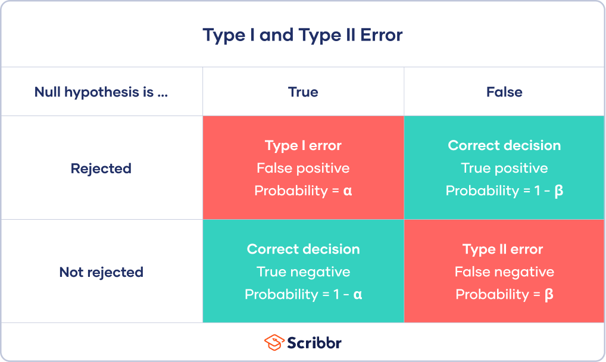

```{r}
# Load packages
library(ggplot2)
library(tidyverse)
library(infer)
```

```{r}
opportunity <- structure(list(decision = structure(c(1L, 1L, 1L, 1L, 1L, 1L, 
1L, 1L, 1L, 1L, 1L, 1L, 1L, 1L, 1L, 1L, 1L, 1L, 1L, 1L, 1L, 1L, 
1L, 1L, 1L, 1L, 1L, 1L, 1L, 1L, 1L, 1L, 1L, 1L, 1L, 1L, 1L, 1L, 
1L, 1L, 1L, 1L, 1L, 1L, 1L, 1L, 1L, 1L, 1L, 1L, 1L, 1L, 1L, 1L, 
1L, 1L, 1L, 1L, 1L, 1L, 1L, 1L, 1L, 1L, 1L, 1L, 1L, 1L, 1L, 1L, 
1L, 1L, 1L, 1L, 1L, 1L, 1L, 1L, 1L, 1L, 1L, 1L, 1L, 1L, 1L, 1L, 
1L, 1L, 1L, 1L, 1L, 1L, 1L, 1L, 1L, 1L, 1L, 2L, 2L, 2L, 2L, 2L, 
2L, 2L, 2L, 2L, 2L, 2L, 2L, 2L, 2L, 2L, 2L, 2L, 2L, 2L, 2L, 2L, 
2L, 2L, 2L, 2L, 2L, 2L, 2L, 2L, 2L, 2L, 2L, 2L, 2L, 2L, 2L, 2L, 
2L, 2L, 2L, 2L, 2L, 2L, 2L, 2L, 2L, 2L, 2L, 2L, 2L, 2L, 2L, 2L
), .Label = c("buyDVD", "nobuyDVD"), class = "factor"), group = structure(c(1L, 
1L, 1L, 1L, 1L, 1L, 1L, 1L, 1L, 1L, 1L, 1L, 1L, 1L, 1L, 1L, 1L, 
1L, 1L, 1L, 1L, 1L, 1L, 1L, 1L, 1L, 1L, 1L, 1L, 1L, 1L, 1L, 1L, 
1L, 1L, 1L, 1L, 1L, 1L, 1L, 1L, 1L, 1L, 1L, 1L, 1L, 1L, 1L, 1L, 
1L, 1L, 1L, 1L, 1L, 1L, 1L, 2L, 2L, 2L, 2L, 2L, 2L, 2L, 2L, 2L, 
2L, 2L, 2L, 2L, 2L, 2L, 2L, 2L, 2L, 2L, 2L, 2L, 2L, 2L, 2L, 2L, 
2L, 2L, 2L, 2L, 2L, 2L, 2L, 2L, 2L, 2L, 2L, 2L, 2L, 2L, 2L, 2L, 
1L, 1L, 1L, 1L, 1L, 1L, 1L, 1L, 1L, 1L, 1L, 1L, 1L, 1L, 1L, 1L, 
1L, 1L, 1L, 2L, 2L, 2L, 2L, 2L, 2L, 2L, 2L, 2L, 2L, 2L, 2L, 2L, 
2L, 2L, 2L, 2L, 2L, 2L, 2L, 2L, 2L, 2L, 2L, 2L, 2L, 2L, 2L, 2L, 
2L, 2L, 2L, 2L, 2L), .Label = c("control", "treatment"), class = "factor")), class = "data.frame", row.names = c(NA, 
-150L))

opportunity
```


# Example: opportunity cost

## Summarizing opportunity cost (1)
```{r}
# Tabulate the data
opportunity %>%
  count(decision, group)
```


```{r}
# Find the proportion who bought the DVD in each group
opportunity %>%
  group_by(group) %>%
  summarize(buy_prop = mean(decision == "buyDVD"))
```
Okay, so about 75% of the control group bought the DVD and about 55% of the treatment group (i.e. The group that was reminded that the money could be saved) bought the DVD. Interesting!


## Plotting opportunity cost (1)

Again, interest is in whether the treatment and control groups were equally likely to buy a DVD after reading the experimental statements. Here, you'll create a barplot to visualize the difference in proportions between the treatment and control groups.

```{r}
# Plot group, filled by decision
ggplot(opportunity, aes(x = group, fill = decision)) + 
  # Add a bar layer, with position "fill"
  geom_bar(position = "fill") +
  ggtitle("oportunity cost")
```


## Randomizing opportunity cost
As in Chapter 2 Exercise 5, you will permute the data to generate a distribution of differences as if the null hypothesis were true.

In the study, the number of individuals in each of the control and treatment groups is fixed. Additionally, when you assume that the null hypothesis is true—that is, the experiment had no effect on the outcome of buying a DVD—it is reasonable to infer that the number of individuals who would buy a DVD is also fixed. That is, 97 people were going to buy a DVD regardless of which treatment group they were in.

Using the new data and the methods from the previous chapter, create a randomization distribution of the difference in proportions calculated on permuted data.

```{r}
# Calculate the observed difference in purchase rate
diff_orig <- opportunity %>%
  # Group by group
  group_by(group) %>%
  # Calculate proportion deciding to buy a DVD
  summarize(prop_buy = mean(decision == "buyDVD")) %>%
  # Calculate difference between groups
  summarize(stat = diff(prop_buy)) %>% 
  pull()

diff_orig
```


```{r}
# Create data frame of permuted differences in purchase rates
opp_perm <- opportunity %>%
  # Specify decision vs. group, where success is buying a DVD
  specify(decision ~ group, success = "buyDVD") %>%
  # Set the null hypothesis to independence
  hypothesize(null = "independence") %>%
  # Generate 1000 reps of type permute
  generate(reps = 1000, type = "permute") %>%
  # Calculate the summary stat difference in proportions
  calculate(stat = "diff in props", order = c("treatment", "control"))
    
# Review the result
opp_perm
```

```{r}
# Using the permuation data, plot stat
ggplot(opp_perm, aes(x = stat)) + 
  geom_histogram(binwidth = 0.005) +
  geom_vline(aes(xintercept = diff_orig), color = "red") + 
  ggtitle("Randomized distribution of difference in proportions")
```


## Summarizing opportunity cost (2)

Now that you've created the randomization distribution, you'll use it to assess whether the observed difference in proportions is consistent with the null difference. You will measure this consistency (or lack thereof) with a p-value, or the proportion of permuted differences less than or equal to the observed difference.

```{r}
# Visualize the statistic 
opp_perm %>%
  visualize(obs_stat = diff_orig, direction = "less")

# Calculate the p-value using `get_p_value`
opp_perm %>%
  get_p_value(obs_stat = diff_orig, direction = "less")

# Calculate the p-value using `summarize`
opp_perm %>%
  summarize(p_value = mean(stat <= diff_orig))
```


p-value is so small (0.006) that is not int he range of the above plot.

## Opportunity cost conclusion

 We can confidently say the different messaging caused the students to change their buying habits, since they were randomly assigned to treatment and control groups. Let's continue.

# Errors and their consecuences



## Different choice of error rate

Consider again a situation where the task is to differentiate the proportion of successes across two different groups. What decision should be made if the goal is to never make a type II error (false negative)?

- Always claim there is a difference in proportions.

Right! If you always claim there is a difference in proportions, you’ll always reject the null hypothesis, so you’ll only make type I errors, if any.

## Errors for two-sided hypotheses

Sometimes you’ll be interested in identifying _any_ difference in proportions (as opposed to one larger proportion). Consider these slightly adjusted hypotheses for the opportunity cost example:

- $H_0$: Reminding students that they can save money for later purchases will not have any impact on students’ spending decisions. 

- $H_A$: Reminding students that they can save money for later purchases will change the chance they will continue with a purchase.

What are type I (false positive) and type II (false negative) errors for the two-sided hypotheses related to the opportunity costs example?

- Type I: There is not a difference in proportions, but the observed difference is big enough to indicate that the proportions are different. 

-Type II: There is a difference in proportions, but the observed difference is not large enough to indicate that the proportions are different.

## p-value of two-sided hypotheses: oportunity costs

The p-value measures the likelihood of data as or more extreme than the observed data, given the null hypothesis is true. Therefore, the appropriate p-value for a two-sided alternative hypothesis is a two-sided p-value.

To find a two-sided p-value, you simply double the one sided p-value. That is, you want to find two times the proportion of permuted differences that are less than or equal to the observed difference.

```{r}
opp_perm %>%
  summarize(p_value = 2*mean(stat<=diff_orig) )
```

Take a moment to remind yourself why you used the proportion of permuted statistics that are smaller than (instead of bigger than) the observed value. Hint: look at the histogram of permuted statistics. –> Because diff_orig is negative.

Alternative way to compute p-valuem using >=

```{r}
opp_perm %>%
  summarize(p_value = 2*mean(stat>= abs(diff_orig)) )
```

To me the 2-sided p-value should note be computed in this way (doubling one-sided p-value), in fact it should be computed with the integral of the area below and up to the diff_orig value, because of the distribution is not perfectly symmetrical. This explains the difference in the p-values above.


# Summary of opportunity costs

## Summary of opportunity costs
The difference in observed proportions is not consistent with the null hypothesis.

## Significance
Only seven of the 1000 permutations for a p-value of (point) .007 were smaller than the observed data value. Even if we had performed a more conservative two-sided test, the p-value would still have been equal to just 14 out of 1000, or (point) .014.

## Causation
Because the p-value is substantially less than .05, we conclude that it was not simply random variability that led to fewer students buying the DVD when being reminded to save. Because the study was randomized, that is, the individuals were randomly assigned the choices, there was nothing systematically different about the participants in the treatment and control groups. The only difference in the two groups was the set of options they received. Therefore, any difference in DVD buying rates is due to the options given, that is, being reminded to save. A causal inference can be made in this setting.

## Random sample
Importantly, however, the 150 individuals in the sample were not randomly sampled from all people. Indeed, they were said to be students. Students are certainly different from the adult population in many ways. In order to generalize to a larger population, we would need more information about the students and who they represented.

