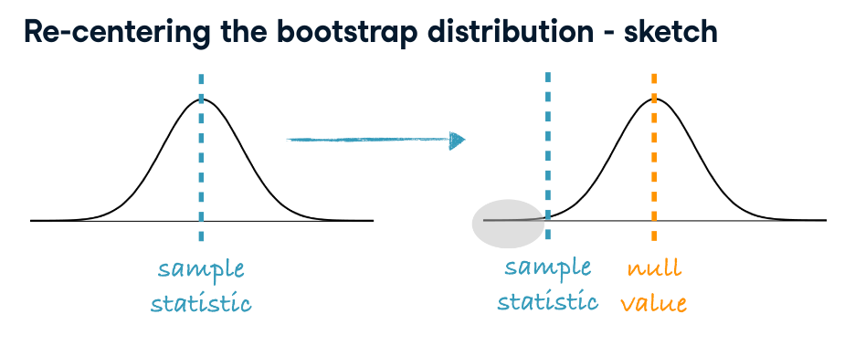

```{r}
library(tidyverse)
library(ggplot2)
library(infer)     # bootstrap
library(openintro) # ncbirths datasets
```

# Welcome to the course!

## Generate bootstrap distribution for median

```{r}
manhattan = read.csv('./datasets/manhattan.csv')
manhattan
```

```{r}
ggplot(manhattan, aes(x =  rent)) +
  # Make it a histogram with a binwidth of 50
  geom_histogram(binwidth = 50) + 
  ggtitle("Original sample distribution")
```

When building a bootstrap distribution for a single statistic, we first generate a series of bootstrap resamples, and then record the relevant statistic (in this case, the median) of each distribution.

```{r}
# Generate bootstrap distribution of medians
rent_med_ci <- manhattan %>%
  # Specify the variable of interest
  specify (response = rent) %>%  
  # Generate 15000 bootstrap samples
  generate(reps = 15000, type = "bootstrap") %>% 
  # Calculate the median of each bootstrap sample
  calculate(stat = "median")

# View its structure
str(rent_med_ci)
```

```{r}
rent_med_ci
```


```{r}
# Plot the rent_med_ci statistic
ggplot(rent_med_ci, aes(x =  stat)) +
  # Make it a histogram with a binwidth of 50
  geom_histogram(binwidth = 50) + 
  ggtitle("Bootstraped sample distribution")
```
Each observation is a median from a bootstrap sample, and each bootstrap sample is a sample taken **with replacement** from the original sample.


# Review percentile and standard error methods for constructing confidence intervals


## Calculate bootstrap interval usign both methods

Using our bootstrap distribution from an earlier exercise, we can calculate bootstrap intervals for the median price of 1 bedroom apartments in Manhattan. Remember that we saved the bootstrap distribution as rent_med_ci.

Calculate a 95% bootstrap confidence interval using the percentile method.


- **METHOD 1: BOOTSTRAP PERCENTILES**

```{r}
# Calculate bootstrap CI as lower and upper quantiles
rent_med_ci %>%
  summarize(
    l = quantile(stat, 0.025),
    u = quantile(stat, 0.975)
  ) 
```
Use the t-distribution to determine the critical value for a 95% confidence interval. qt() takes the percentile of the t-distribution you want to find and the degrees of freedom as arguments.

```{r}
# From previous step
rent_med_obs <- manhattan %>%
  summarize(median_rent = median(rent)) %>%
  pull()

# Calculate the degrees of freedom
degrees_of_freedom <- nrow(manhattan) - 1  

# Determine the critical value
t_star <- qt(0.975, df = degrees_of_freedom)
```


```{r}
rent_med_obs
degrees_of_freedom
t_star
```

- **METHOD 2: BOOTSTRAP STD ERROR**

```{r}
# Calculate the CI using the std error method
rent_med_ci %>%
  # Calculate the std error of the statistic
  summarize(boot_se = sd(stat)) %>%
  # Calculate the lower and upper limits of the CI
  summarize(
    l = rent_med_obs - t_star * boot_se,
    u = rent_med_obs + t_star * boot_se
  )
```


## Which method is more appropiate: percentiel or SE ? 

- Standard Error method


## Doctor visits during pregnancy 

The state of North Carolina released to the public a large data set containing information on births recorded in this state. This data set has been of interest to medical researchers who are studying the relation between habits and practices of expectant mothers and the birth of their children. The ncbirths dataset (which is already loaded for you) is a random sample of 1000 cases from this data set. Among other variables, the number of doctor's visits (visits) the mother had throughout the pregnancy is recorded. Which of the following is false about the distribution of visits?

```{r}
ncbirths
```

"On average, mothers visit the doctor approximately 12 times throughout pregnancy." -> TRUE

```{r}
summary(ncbirths)
```

"The distribution of number of doctor's visits is unimodal and roughly symmetric." -> TRUE
```{r}
ggplot(ncbirths, aes(x =  visits)) +
  geom_histogram(binwidth = 1) + 
  ggtitle("Visits sample distribution")
```


"The median number of doctor's visits throughout the pregnancy is roughly equal to the mean number of visits." -> TRUE


"The number of doctor's visits for one of the mothers in the dataset is missing." -> FALSE

```{r}
sum(is.na(ncbirths["visits"]))
```
At least from **9 mothers**, there are no records of visits.


## Average number of doctors visits

Next, we construct a bootstrap interval for the average number of doctor's visits during pregnancy.

```{r}
# Filter for rows with non-missing visits
ncbirths_complete_visits <- ncbirths %>%
  filter(!is.na(visits))
  
# See the result
glimpse(ncbirths_complete_visits)
```


```{r}
# Generate 15000 bootstrap means
visit_mean_ci <- ncbirths_complete_visits %>%
  # Specify visits as the response
  specify(response = visits) %>%
  # Generate 15000 bootstrap replicates
  generate(reps = 15000, type = "bootstrap") %>%
  # Calculate the mean
  calculate(stat = "mean")

visit_mean_ci
```


```{r}
# Calculate the 90% CI via percentile method
visit_mean_ci %>%
  summarize(
    l = quantile(stat, 0.05),
    u = quantile(stat, 0.95)
  ) 
```

## SD of number of doctor's visits

```{r}
# Calculate 15000 bootstrap standard deviations of visits
visit_sd_ci <- ncbirths_complete_visits %>%
  specify(response = visits) %>%
  # Generate 15000 bootstrap replicates
  generate(reps = 15000, type = "bootstrap") %>%
  # Calculate the mean
  calculate(stat = "sd")
  
# See the result
visit_sd_ci
```


```{r}
# Calculate the 90% CI via percentile method
visit_sd_ci %>%
  summarize(
    l = quantile(stat, 0.05),
    u = quantile(stat, 0.95)
  )
```


# Re-centering a bootstrap distribution

* Bootstrap dists. are by design centered at the observed sample statistic. 
* However since in a hypothesis test we assume that $H_0$ is true, we shift the bootstrap dist. to be centered at the null value.
*p-value = The proportion of simulations that yield a sample statistic at least as favorable to the alternative hypothesis as the observed sample statistic.




Let's turn our attention back to Manhattan apartments. We would like to evaluate whether this data provides evidence that the median rent of 1 BR apartments in Manhattan is greater than $2,500.

- $H_0$ : Median rent of 1 BR appartaments in Manhattan is == 2500
- $H_A$ : Median retn of 1 BR appartaments in Manhattan in 2350


```{r}
# From previous step
n_replicates <- 15000
rent_med_ht <- manhattan %>%
  specify(response = rent) %>%
  hypothesize(null = "point", med = 2500) %>% 
  generate(reps = n_replicates, type = "bootstrap") %>% 
  calculate(stat = "median")
rent_med_ht
```

```{r}
ggplot(rent_med_ht, aes(stat)) + 
  geom_histogram()
```


```{r}
rent_med_obs <- manhattan %>%
  summarize(median_rent = median(rent)) %>%
  pull()

rent_med_obs
```

Manually calculation of one-sided p-value

```{r}
rent_med_ht %>%
  # Filter for bootstrap stat greater than or equal to observed stat
  filter(stat >= rent_med_obs) %>%
  # Calculate the p-value
  summarize(p_val = n() / n_replicates)
```

**Even with a null-distribution, its pretty common to see a value equal or more extreme than  (2350), so this value is plausible under the null hyphotesis, and consecuently we FAIL to reyect the null hypothesis.**


With infer: 

```{r}
rent_med_ht %>% 
 visualize() + 
 shade_p_value(obs_stat = rent_med_obs, direction = "greater")

rent_med_ht %>% 
 infer::get_p_value(obs_stat = rent_med_obs, direction = "greater")
```

We **fail to reject $H_0$ since the p-value is above the significance level**, and conclude that the data do not provide convincing evidence that median rent of 1 BR apartments in Manhattan is greater than $2500.


## Test for average weight of babies 

We'll wrap up inference on a single parameter of a numerical distribution by revisiting the ncbirths dataset, specifically the weight variable, indicating the birth weight of the baby. Do these data provide convincing evidence that the average birth weight of babies born in North Carolina is **different** than 7 pounds?

```{r}
n_replicates <- 1500

weight_mean_ht <- ncbirths %>%
  specify(response = weight) %>%
  hypothesize(null = "point", mu = 7) %>% 
  generate(reps = n_replicates, type = "bootstrap") %>% 
  calculate(stat = "mean")
```


```{r}
weight_mean_ht %>% visualize()
```

```{r}
# Calculate observed mean
weight_mean_obs <- ncbirths %>%
  # Summarize to calculate the mean observed weight
  summarize(mean_weight = mean(weight)) %>% 
  # Pull out the value
  pull()

weight_mean_obs
```


```{r}
weight_mean_ht %>% 
  visualize()  +
  shade_p_value(obs_stat = weight_mean_obs, direction = "greater")
```

```{r}
# Calculate p-value
weight_mean_ht %>%
  # Filter on stat greater than or equal to weight_mean_obs
  filter(stat >= weight_mean_obs) %>%
  # p_val is twice the number of filtered rows divided by the total number of rows
  summarize(
    one_sided_p_val = n() / n_replicates,
    two_sided_p_val = 2 * one_sided_p_val
  )
```


```{r}
weight_mean_ht %>% 
  get_p_value(obs_stat = weight_mean_obs, direction = "greater")
```


**So, under the null hypothesis of baby mean weight of 7 lb, the p-value (2-sided) of observe a baby with weight > 7.1 its = 0.03, so we reyect the null hypothesis since there is significant evidence for the fact a baby weight its greater than 7, but the p-value is closer to the threshod 0.05, so we recommend precaution with this result.**
