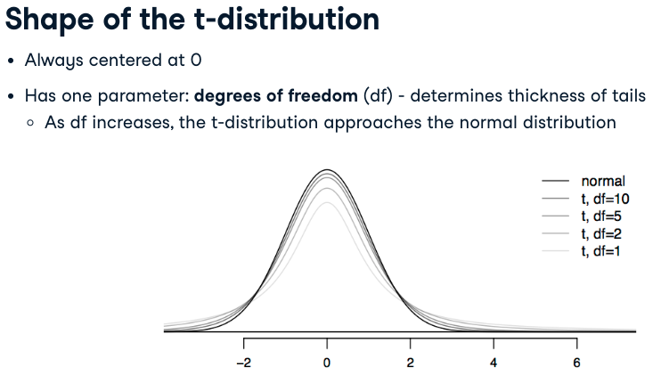
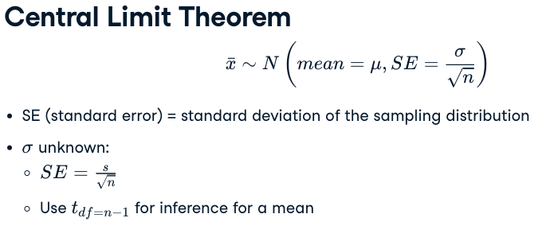
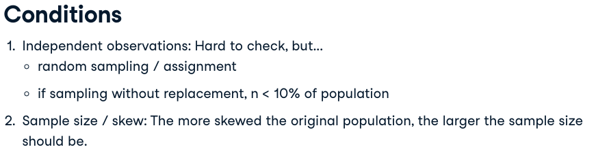
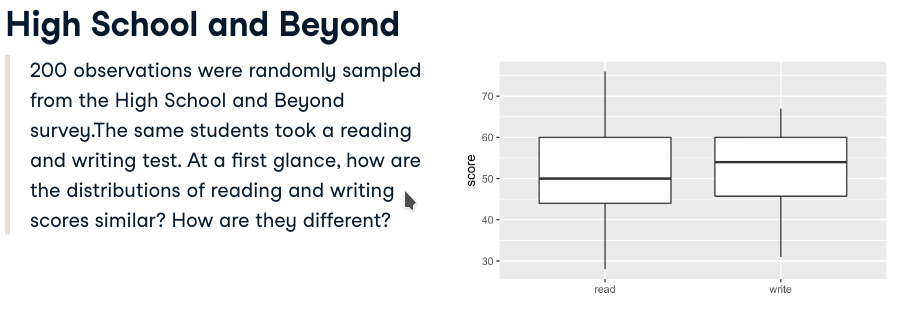
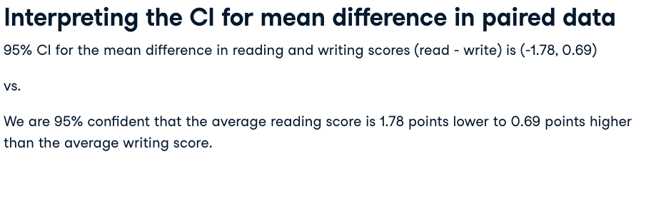
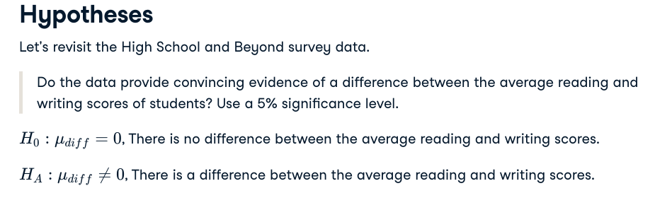
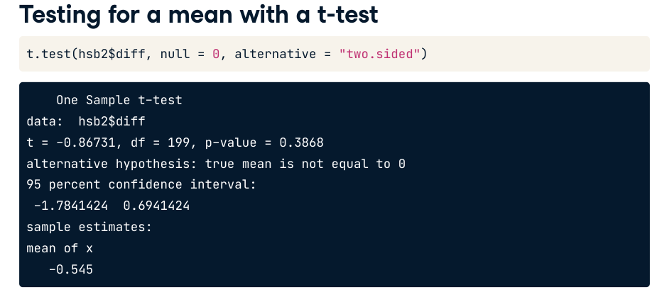

```{r}
library(tidyverse)
library(ggplot2)
library(infer)     # bootstrap


acs12     <- readRDS("./datasets/acs12.rds")
textbooks <- readRDS("./datasets/textbooks.rds")
hsb2 <- readRDS("./datasets/hsb2.rds")
```


# t-distribution



## When to t? 

Which of the following describes best why we might need to use the t-distribution for inference?:

- population distribution is not known

- **population standard deviation is unknown**

- sample is not random

- sample is not representative of the population


## Probabilities under the t-distribution

We can use the pt() function to find probabilities under the t-distribution. For a given **cutoff value** _q_ and a given degrees of freedom _df, pt(q, df)_ gives us the probability under the t-distribution with _df_ degrees of freedom for values of _t_ less than _q_. In other words,  $P(t_{df} < T)$ = pt(q = T, df).


Find the probability under the t-distribution with 10 degrees of freedom below $T=3$.
```{r}
# P(T < 3) for df = 10
(x <- pt(3, df = 10))
```

```{r}
# P(T > 3) for df = 10
(y <- 1 - x)
```

```{r}
# P(T > 3) for df = 100
(z <- 1 - pt(3, df = 100))
```

```{r}
# Comparison
y == z
y > z
y < z
```


## Cutoffs under the t-distribution

We can use the qt() function to find cutoffs under the t-distribution. For a given probability p and a given degrees of freedom df, qt(p, df) gives us the cutoff value for the t-distribution with df degrees of freedom for which the probability under the curve is p. In other words, if $P(t_{df}<T=p)$, then $T$ =  qt(p, df). For example, if  corresponds to the 95th percentile of a distribution, . The "middle 95%" means from p = 0.025 to p = 0.975.

```{r}
# 95th percentile for df = 10
(x <- qt(0.95, df = 10))
```

```{r}
# Upper bound of middle 95th percent for df = 10
(y <- qt(0.975, df = 10))
```

```{r}
# Upper bound of middle 95th percent for df = 100
(z <- qt(0.975, df = 100))
```

```{r}
# Comparison
y == z
y > z
y < z
```


# Estimating a mean with a t-interval






## Average conmute time of Americans

Each year since 2005, the US Census Bureau surveys about 3.5 million households with The American Community Survey (ACS). Data collected from the ACS have been crucial in government and policy decisions, helping to determine the allocation of federal and state funds each year. Data from the 2012 ACS is available in the acs12 dataset.

When given one argument, t.test() tests whether the population mean of its input is different than 0. That is $H_0 : \mu_{diff} = 0$ and $H_A : \mu_{diff} \neq 0$. It also provides a 95% confidence interval.


```{r}
# Filter for employed respondents
acs12_emp <- acs12 %>%
  filter(employment == "employed")

# Construct 95% CI for avg time_to_work
t.test(acs12_emp$time_to_work)
```
```{r}
mean(acs12_emp$time_to_work, na.rm = TRUE)
```


## Average number of hours worked
Full-time employment is employment in which a person works a minimum number of hours defined as such by his/her employer. Companies in the United States commonly require 40 hours per week to be considered a full time employee. We will use data from the American Community Survey to estimate the number of hours Americans work.

```{r}
t.test(acs12_emp$hrs_work)
```
```{r}
mean(acs12_emp$hrs_work, na.rm = TRUE)
```


# t-interval for paired data

In this video we discuss how we estimate the mean difference between data coming from **two dependent groups**, in other words, paired data. 

When two sets of observations have the special correspondence, or in other words, they're not independent, they're said to be paired. To analyze paired data, it is often useful to look at the difference in outcomes of each pair of observations. So here for example, for each student, we subtract their writing score from their reading score, and create a new variable, called diff, for the difference between the two scores for each student.

Our goal is to construct a 95% confidence interval for the mean difference between the average reading and writing scores.






## t-interval at various levels

A random sample was taken of nearly 10% of UCLA courses. The most expensive textbook for each course was identified, and its price at the UCLA Bookstore and on Amazon.com were recorded. These data are recorded in the textbooks dataset. We want to test whether there is a difference between the average prices of textbooks sold in the bookstore vs. on Amazon.

Since the book price data are paired (the price of the same book at the two stores are not independent), rather than using individual variables for the prices from each store, you will look at the a single variables of the differences in price. The diff column the UCLA Bookstore price minus the Amazon.com price for each book.


```{r}
textbooks
```


```{r}
textbooks %>% 
  ggplot(aes(x = diff)) + 
  geom_histogram() +
  ggtitle("Price differences between books in library and amazon")
```


```{r}
# Run a t-test on diff with a 90% CI
t.test(textbooks$diff, conf.level = 0.90)

# Same with 95% CI
t.test(textbooks$diff, conf.level = 0.95)

# Same with 99% CI
t.test(textbooks$diff, conf.level = 0.99)
```


## Understanding confidence intervals

Which of the following is false about confidence intervals when all else is held constant?

- As the confidence level increases, the margin of error of the interval increases as well.

- As the confidence level increases, the width of the interval increases as well.

- **As the sample size increases, the margin of error of the interval increases as well.** -> FALSE, A larger sample size will decrease the margin of error of the interval.

- As the sample size increases, the precision of the interval increases as well.


# Testing a mean with a t-test





## Estimating the median difference in textbook prices

Suppose instead of the mean, we want to estimate the median difference in prices of the same textbook at the UCLA bookstore and on Amazon. You can't do this using a t-test, as the Central Limit Theorem only talks about means, not medians. You'll use an infer pipeline to estimate the median.

```{r}
# Calculate 15000 bootstrap medians of diff
textdiff_med_ci <- textbooks %>%
  specify(response = diff) %>%
  generate(reps = 15000, type = "bootstrap") %>%
  calculate(stat = "median")
```


```{r}
# Calculate the 95% CI via percentile method
textdiff_med_ci %>%
  summarize(
    l = quantile(stat, 0.025),
    u = quantile(stat, 0.975)
  )
```


## Test for a difference in median tests scores

The High School and Beyond survey is conducted on high school seniors by the National Center of Education Statistics. We randomly sampled 200 observations from this survey, and these data are in the hsb2 data frame (which is already loaded for you). Among other variables, this data frame contains scores on math and science scores of each sampled student.

```{r}
hsb2 %<>% 
  select(math, science) %>% 
  mutate(diff = math - science)

hsb2 %>% 
  ggplot(aes(y = diff)) + 
  geom_boxplot() + 
  ggtitle("math - science")
```


```{r}
scorediff_med_obs <- hsb2 %>% 
  summarize(median_diff = median(diff)) %>% 
  pull

scorediff_med_obs
```


```{r}
n_replicates <- 15000

# Generate 15000 bootstrap medians centered at null
scorediff_med_ht <- hsb2 %>%
  specify(response = diff) %>%
  hypothesize(null = "point", med = 0) %>% 
  generate(reps = n_replicates, type = "bootstrap") %>% 
  calculate(stat = "median")
```

```{r}
scorediff_med_ht %>% 
  ggplot(aes(y = stat)) + 
  geom_boxplot()
```

```{r}
# Calculate two-sided p-value
scorediff_med_ht %>%
  filter(stat >= scorediff_med_obs) %>%
  summarize(
    one_sided_p_val = n()/n_replicates,
    two_sided_p_val = one_sided_p_val*2
  )
```

```{r}
scorediff_med_ht %>% 
  get_p_value(obs_stat = scorediff_med_obs, direction = "two_sided")
```
We can not reyect the null-hypothesis of the difference is significative.


## Interpret the p-value

Which of the following is the correct definition of the p-value of this hypothesis test?

- The probability of getting a random sample of 200 high school students where the median difference between their math and science test scores is at least 1, if in fact there is no difference between the median math and science scores.


