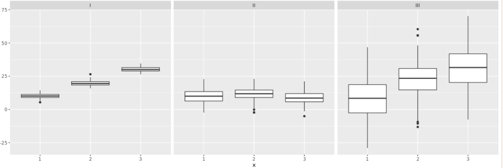

# Vocabulary score vay between vs (self identified) social class

In this chapter we will use ANOVA (analysis of variance) to test for a difference in means across many groups.

```{r}
library(tidyverse)
library(magrittr)
library(ggplot2)
library(infer)
library(broom)

gss = read_csv("datasets/gss.csv")
```


## EDA for vocabulary score vs. social class

Before we conduct inference, we should take a look at the distributions of vocabulary scores across the levels of (self identified) social class.

```{r}
gss
```


```{r}
# Using gss, plot wordsum
ggplot(gss, mapping = aes(x = wordsum)) +
  # Add a histogram layer
  geom_histogram(binwidth = 1) +
  # Facet by class
  facet_wrap(~class)
```


## Comparing many means, visually 

Which of the following plots shows groups with means that are most and least likely to be significantly different from each other?


Most likely: 1, least likely: 2


# ANOVA


## ANOVA for vocabulary score vs. (self identified) social class
Let's conduct the ANOVA for evaluating whether there is a difference in the average vocabulary scores between the levels of (self identified) social class.

```{r}
# Run an analysis of variance on wordsum vs. class
aov_wordsum_class <- aov(wordsum ~ class, data = gss)

# Tidy the model
tidy(aov_wordsum_class)
```
additional features: 

- SST = 236.5644 + 2869.8003 = 3106.365
- percentage of explained variability 236.56/3106.36 = 7.6 %

If we where set up a regression wordsum ~ class -> $R² =$ 7.6 %


# Conditions for ANOVA

- independence 
  - within groups : sampled observations must be independent
  - between groups : the groups must be independent of each other (non-paired)

- approximate normality: distribution of the response variable should be nearly normal withing each group

- equal variance : groups should have roughtly equal variability

## Checking the normality condition

Which of the following provides the most complete information for checking the normality condition for the ANOVA for evaluating whether there are differences between the average vocabulary scores across social classes?

- Histogram of vocabulary scores, faceted by social class


Graph showed above.


## Checking the constant variance condition

```{r}
gss %>%
  group_by(class) %>%
  summarize(std_dev_wordsum = sd(wordsum))
```

# Post-hoc testing

Finding a statistically significant result at the end of an ANOVA however only tells us that at least one pair of means are different, but not which pair of means are different. 

And when doing so we're going to discuss how to control the Type I error rate that would be inflated by doing many pairwise tests in the quest for identifying the groups whose means are significantly differnt from each other. Remember that to determine whether two means are different from each other we use t-tests, with each test you incur a possibility of a Type 1 error. The probability of committing a Type 1 error is the significance level of the test, which is often set at 5%. When you do multiple tests to compare each possible pairing of groups to each other, then you inflate your overall Type 1 error rate, which is an undesirable outcome However there's a simple solution: use a modified significance level, that is, a lower significance level, for each pairwise test, so that the overall Type 1 error rate for the series of tests you have to do can still be held at a low rate.


Testing many pairs of groups is called multiple comparisons and a common modification we use when doing multiple comparisons is the **Bonferroni correction ($\alpha$)** which uses a more **stringent significance level** for each of the pairwise tests more specifically, we adjust our alpha by the number of comparisons we have to do the Bonferroni corrected significance level can be calculated as the original significance level divided by the number of pairwise comparisons to be carried out. This number can be calculated as k:

$$
\alpha* = \frac{\alpha}{K},  K=\frac{k(k-1)}{2}
$$
where $\alpha$ = original significance level,
 
$K$ = number of pairwise comparisons to carry out
 
and $k$ = number of groups in the ANOVA

There are additional considerations when doing this pairwise comparisions:


- constant variance -> re-think standard error and degrees of freedon: Use consistente standard error ad degreees for all tests

- compare the p-values from each test to the modified significance leve


## Calculate alpha*

```{r}
k     = 4
(K     = (k*(k-1))/2)
```

```{r}
alpha = 0.05
(alpha_star = alpha/K)
```


## Comparte pairwise means

Compare means of vocabulary scores using the pairwise.t.test() function for all pairings of social classes.

```{r}
t_test_results <- pairwise.t.test(gss$wordsum, gss$class, p.adjust.method = "none")
t_test_results
```

```{r}
# Tidy the result
tidy(t_test_results)
```

Compare against new significance value ($\alpha*$) : 

```{r}
tidy(t_test_results) %>% 
  filter(p.value < alpha_star)
```

There is evidence that the differences between:

- middel and lower
- working and middle

are statistically significative.


